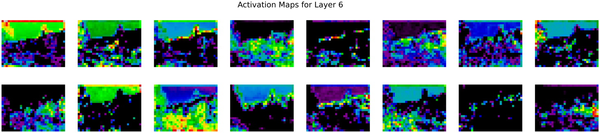

# style-transfer-vis
UI for Style Transfer Visualization Project -- Jared Amen, Pranav Rajan, Alan Weber -- University of Utah, Fall 2021, Dr. Bei Wang-Phillips

## How to Use This Workbench

**Note:** If you are using this software with our default images (`tubingen.jpg` and `starry_night.jpg` -- see below)), you can simply 
run style transfer with the default parameters, as the UI is set up by default for optimal handling of hyperparameters and these images.

### Step 0: Start Streamlit Server from Colab Notebook (or access public URL)

Before you can begin, you will need to either access the public URL for this workbench or, if this doesn't work, start a tunneled Streamlit server from the Colab Notebook for this project. The demo video below, and the aforementioned Colab Notebook (specifically, the "Style Transfer in Streamlit" section), shows how to do this.

- **Public URL:** https://683f-35-204-148-47.ngrok.io/
- **Colab Notebook:** https://colab.research.google.com/drive/18B0gRc5kyuRB3FdsTRs9NCX0fHBNRQUU?usp=sharing
- **Demo Video:** https://youtu.be/5f0Q7ypJtBs

### Step 1: Upload a Content and Style Image
You can upload any content and style image (**in JPG format**) you'd like. Keep in mind that the content image is the "destination" image and the style image is the "source" image.

### Step 2: Choose Image Sizes

The image size is the smallest dimension of the image. For example, if you want to use the image `tubingen.jpg` as the content image, you can choose the image size to be the smallest dimension of the image (e.g. `192`). This will ensure that the content loss is minimized. If you choose a larger image size, the style transfer will take longer to run, but the resulting image will be more detailed.


### Step 3: Select Style Layers and Weights

Specify a list of which layers to use for style loss. Each layer corresponds to the respective feature as in the summary [here](#squeezenet-feature-summary). Each layer is assigned an inputted weight, which is used to calculate the style loss for the respective layer. We generally use higher weights for 
the earlier style layers because they describe more local/smaller scale features, which are more important to texture than features over larger 
receptive fields. In general, increasing these weights will make the resulting image look less like the original content and more distorted towards 
the appearance of the style image.


### Step 4: Select Content Layer

Specify a layer you want to use for content loss. Each layer corresponds to the respective feature as in the summary [here](#squeezenet-feature-summary). The layer is assigned an inputted weight, which is used to calculate the content loss for the respective layer. Increasing the value of this parameter will make the final image look more realistic (closer to the original content).


### Step 5: Select Number of Epochs
Select the number of epochs you want to run style transfer for. Higher epoch counts will take longer to run, but the resulting image will be more detailed.

### Step 6: Select Total Variation Weight

Specify the total variation regularization weight in the overall loss function. Increasing this value makes the resulting image look smoother and less jagged, at the cost of lower fidelity to style and content.


### Step 7: Select Learning Rate Hyperparameters

Specify learning rate hyperparameters for the optimizer. They are defined as such:
- `initial_lr`: The learning rate for the optimizer
- `decay_lr_at`: The epoch # at which to decay the learning rate to `decayed_lr` (by default, this is 90 percent of the total epoch count specified)
- `decayed_lr`: The decayed learning rate for the optimizer (after `decay_lr_at` epochs)


### Step 8: Modify Output Frequency and Structure of Intermediate Results

Specify details related to output frequency and structure of intermediate results. This workbench supports the following specifications:
- *Epoch Frequency for Observing Intermediate Results.* This defines how often the workbench will output intermediate resultant images and activation maps.
- *Intermediate Layers to Visualize.* This defines which layers to visualize for each intermediate result.
- *Channel Criterion for Activation Maps.* This defines which channels to visualize for each layer. This workbench supports the following specifications for channel criteria:
    - `first_16`: Visualize the first 16 channels of the layer
    - `last_16`: Visualize the last 16 channels of the layer
    - `first_32`: Visualize the first 32 channels of the layer
    - `last_32`: Visualize the last 32 channels of the layer
    - `every_eighth`: Visualize every 8th channel of the layer
    - `every_sixteenth`: Visualize every 16th channel of the layer
- *Color Mapping.* This defines how to color the activation maps. This workbench supports the following specifications for color mappings:
    - `nipy_spectral`: Spectral Color Mapping
    - `jet`: Jet Color Mapping
    - `gray`: Grayscale Color Mapping
    - `rainbow`: Rainbow Color Mapping
- *Random Initialization.* This defines whether to use random noise or the content image as an initial image.

### Step 9: Run Style Transfer

From here, you can run style transfer! The output as you have specified it will be written to the content display of this workbench. You can download individual outputs by right-clicking on the image and saving it.

## Project Introduction

### Background and Motivation

- Artificial Neural Networks are increasingly prevalent in analytic solutions for many industries
- Understanding their “decision making process” is a key factor in the adoption of this technology
- Visual interpretation of their operation constitutes a big step in this direction
- The “style transfer” use case for convolutional neural nets (CNNs) is visually compelling and germane for manufacturing defect inspection applications

### Convolutional Neural Net (CNN) Basics

[Convolutional neural nets](https://towardsdatascience.com/simple-introduction-to-convolutional-neural-networks-cdf8d3077bac) consist of some `n` layers, where each layer is one of the following types:

- `convolution + ReLU`: Where filters are applied to the original image (this is the crux of the problem).
- `pooling`: Used to reduce the dimensionality of the network. increases the number of channels to compensate
- `fully connected + ReLU`: Used to flatten channels of results before classification
- `softmax`: The final "classification" layer

Below is an image of an exemplary CNN.


The below image shows intermediate activation maps of VGG-16, a neural net trained for image recognition, which shows a similar low-to-high level of feature extraction from lower to higher layers (ending with a linearly separable classifier).


### Style Transfer Use Case

Below we see the behavior and use case of style transfer. Style Transfer is a technique for transferring style from one image to another.
For instance, with a neural net trained for style transferral, we can transpose the style of *Starry Night* by Van Gogh to a picture of
architecture in Tubingen, Germany. [SqueezeNet](https://arxiv.org/abs/1602.07360) is one such neural net trained for style transferral, and it consists of 13 layers, where some
modules utilize a unique "Fire" architecture, whereby "Fire" modules consist of a "squeeze" layer with 1x1 filters feeding an "expand" layer with 1x1
and 3x3 filters. This architecture achieves [AlexNet](https://en.wikipedia.org/wiki/AlexNet)-level accuracy on [ImageNet](https://image-net.org/) with 50x fewer parameters.
The structure is defined below:


### SqueezeNet Feature Summary
```
Sequential(
(0): Conv2d(3, 64, kernel_size=(3, 3), stride=(2, 2))
(1): ReLU(inplace=True)
(2): MaxPool2d(kernel_size=3, stride=2, padding=0, dilation=1, ceil_mode=True)
(3): Fire(
    (squeeze): Conv2d(64, 16, kernel_size=(1, 1), stride=(1, 1))
    (squeeze_activation): ReLU(inplace=True)
    (expand1x1): Conv2d(16, 64, kernel_size=(1, 1), stride=(1, 1))
    (expand1x1_activation): ReLU(inplace=True)
    (expand3x3): Conv2d(16, 64, kernel_size=(3, 3), stride=(1, 1), padding=(1, 1))
    (expand3x3_activation): ReLU(inplace=True)
)
(4): Fire(
    (squeeze): Conv2d(128, 16, kernel_size=(1, 1), stride=(1, 1))
    (squeeze_activation): ReLU(inplace=True)
    (expand1x1): Conv2d(16, 64, kernel_size=(1, 1), stride=(1, 1))
    (expand1x1_activation): ReLU(inplace=True)
    (expand3x3): Conv2d(16, 64, kernel_size=(3, 3), stride=(1, 1), padding=(1, 1))
    (expand3x3_activation): ReLU(inplace=True)
)
(5): MaxPool2d(kernel_size=3, stride=2, padding=0, dilation=1, ceil_mode=True)
(6): Fire(
    (squeeze): Conv2d(128, 32, kernel_size=(1, 1), stride=(1, 1))
    (squeeze_activation): ReLU(inplace=True)
    (expand1x1): Conv2d(32, 128, kernel_size=(1, 1), stride=(1, 1))
    (expand1x1_activation): ReLU(inplace=True)
    (expand3x3): Conv2d(32, 128, kernel_size=(3, 3), stride=(1, 1), padding=(1, 1))
    (expand3x3_activation): ReLU(inplace=True)
)
(7): Fire(
    (squeeze): Conv2d(256, 32, kernel_size=(1, 1), stride=(1, 1))
    (squeeze_activation): ReLU(inplace=True)
    (expand1x1): Conv2d(32, 128, kernel_size=(1, 1), stride=(1, 1))
    (expand1x1_activation): ReLU(inplace=True)
    (expand3x3): Conv2d(32, 128, kernel_size=(3, 3), stride=(1, 1), padding=(1, 1))
    (expand3x3_activation): ReLU(inplace=True)
)
(8): MaxPool2d(kernel_size=3, stride=2, padding=0, dilation=1, ceil_mode=True)
(9): Fire(
    (squeeze): Conv2d(256, 48, kernel_size=(1, 1), stride=(1, 1))
    (squeeze_activation): ReLU(inplace=True)
    (expand1x1): Conv2d(48, 192, kernel_size=(1, 1), stride=(1, 1))
    (expand1x1_activation): ReLU(inplace=True)
    (expand3x3): Conv2d(48, 192, kernel_size=(3, 3), stride=(1, 1), padding=(1, 1))
    (expand3x3_activation): ReLU(inplace=True)
)
(10): Fire(
    (squeeze): Conv2d(384, 48, kernel_size=(1, 1), stride=(1, 1))
    (squeeze_activation): ReLU(inplace=True)
    (expand1x1): Conv2d(48, 192, kernel_size=(1, 1), stride=(1, 1))
    (expand1x1_activation): ReLU(inplace=True)
    (expand3x3): Conv2d(48, 192, kernel_size=(3, 3), stride=(1, 1), padding=(1, 1))
    (expand3x3_activation): ReLU(inplace=True)
)
(11): Fire(
    (squeeze): Conv2d(384, 64, kernel_size=(1, 1), stride=(1, 1))
    (squeeze_activation): ReLU(inplace=True)
    (expand1x1): Conv2d(64, 256, kernel_size=(1, 1), stride=(1, 1))
    (expand1x1_activation): ReLU(inplace=True)
    (expand3x3): Conv2d(64, 256, kernel_size=(3, 3), stride=(1, 1), padding=(1, 1))
    (expand3x3_activation): ReLU(inplace=True)
)
(12): Fire(
    (squeeze): Conv2d(512, 64, kernel_size=(1, 1), stride=(1, 1))
    (squeeze_activation): ReLU(inplace=True)
    (expand1x1): Conv2d(64, 256, kernel_size=(1, 1), stride=(1, 1))
    (expand1x1_activation): ReLU(inplace=True)
    (expand3x3): Conv2d(64, 256, kernel_size=(3, 3), stride=(1, 1), padding=(1, 1))
    (expand3x3_activation): ReLU(inplace=True)
)
```

Fire modules are illustrated in better detail below:


## Feature Visualization

- SqueezeNet has 13 different layers and each layer generates an output of a different number of channels (multiple of 16)
- Features (activation vector for each layer) are represented as tensors
- To visualize the features of intermediate layers, we capture 16 different channels of the output of every layer depending on an epoch factor selected by a user
- We experimented with different colormaps including spectral, greyscale, jet, and rainbow
- We chose spectral because it had a good proportion of Red, Green and Blue values especially for individual pixels in the last few layers


To test intermediate visualization, we used the following content and style image:


With these input images, we are able to utilize this playground interface to generate intermediate composite images *and* intermediate activation maps of SqueezeNet as ran on them.
We used the following parameters to generate the intermediate composite images and activation maps:


```
{
    'content_img': './src/assets/input-imgs/tubingen.jpg',
    'style_img': './src/assets/input-imgs/starry_night.jpg',
    'content_size': 192,
    'style_size': 192,
    'style_layers': [1, 4, 6, 7],
    'content_layer': 3,
    'style_weights': [300000, 1000, 15, 3],
    'content_weight': 0.06,
    'tv_weight': 0.02,
    'num_epochs': 200,
    'init_random': False,
    'observe_intermediate_result_count': 5,
    'decay_lr_at': 180,
    'decayed_lr': 0.1,
    'initial_lr': 3.0,
    'layer_vis_choices': [i for i in range(available_layers)],
    'channel_vis_choice': 'first_16',
    'color_mapping': 'nipy_spectral'
}
```

Using these hyperparameters, intermediate composite images and activation maps for epochs 0, 100, and 195 (layers 0, 6, and 12 for activation maps) are shown below:

col1, col2, col3 = st.columns(3)


**Activation Maps at Epoch 0:**





**Activation Maps at Epoch 100:**


**Activation Maps at Epoch 195:**


The final image is shown below.


## References

The developers of this workbench would like to thank the following sources for their contributions to our work:
- University of Utah CS 6955: Deep Learning, Prof Berton Earnshaw for the original implementation of Neural Style Transfer using SqueezeNet as described here
- Brijesh Thumar, [How to Visualize Convolutional Neural Networks Using PyTorch](https://androidkt.com/how-to-visualize-feature-maps-in-convolutional-neural-networks-using-pytorch/)
- Distill Publication, [Activation Atlas](https://distill.pub/2019/activation-atlas/)
- Zan Armstrong, Chris Olah, [Building Blocks of Machine Learning Interpretability](https://distill.pub/2018/building-blocks/#ActivationGridSingle)
- Zan Armstrong, Chris Olah, [Interactivity of Machine Learning Interpretability](https://distill.pub/2017/feature-visualization/#interaction)
- Google, [TensorBoard](https://www.tensorflow.org/tensorboard)
- Google, [Teachable Machine](https://teachablemachine.withgoogle.com/)


## Software Used

The following software was used to create this workbench:
- **Packages:** [Streamlit](https://streamlit.io/) (UI and Web Application), [Numpy](https://numpy.org/) (vector math), [Matplotlib](https://matplotlib.org/) (visualization)
- **Deep Learning Framework:** [PyTorch](https://pytorch.org/)
- **Neural Network:** [SqueezeNet](https://arxiv.org/abs/1602.07360) (trained on the [ImageNet](https://image-net.org/) dataset)
- **Implementation:** Google Colab Pro